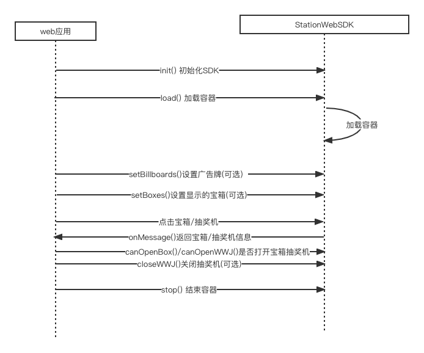

# Station Web SDK

## 构建

```bash
# clone the project
git clone https://github.com/CrossEevery/station-web-sdk.git

# enter the project directory
cd station-web-sdk

# install dependency
npm install

# develop
npm run dev

# build for production environment
npm run build
```

## 流程说明



## 使用方法

### 1. 引入方式

import 方式引入

```javascript
import StationWebSDK from 'station-web-sdk';
```

或 script 标签引入

```javascript
<script type="text/javascript" src="./station-web-sdk.js"></script>
```

### 2. 详细用法

- 初始化 SDK

  ```javascript
  StationWebSDK.init({
    uuid: '',
    ticket: '',
    stationId: 0, // 空间站id
    mount: 'station', // 加载节点
    api: '', // api地址
  });
  ```

  参数说明：

  | 字段名    | 类型   | 说明         |
  | --------- | ------ | ------------ |
  | uuid      | string | 用户 uuid    |
  | ticket    | string | 用户 ticket  |
  | stationId | number | 空间站 id    |
  | mount     | string | 页面加载元素 |
  | api       | string | 后端接口地址 |

- 加载容器

  ```javascript
  StationWebSDK.load(onMessage);
  ```

  参数说明：

  | 字段名    |      | 类型     | 说明                                           |
  | --------- | ---- | -------- | ---------------------------------------------- |
  | onMessage |      | Function | 消息回调函数                                   |
  |           | type | string   | 消息类型 open-wwj 点击抽奖机 open-box 点击宝箱 |
  |           | data | string   | 消息内容                                       |

- 设置广告牌

  ```
  StationWebSDK.setBillboards(billboards);
  ```

  参数说明：

  | 字段名     |          | 类型     | 说明         |
  | ---------- | -------- | -------- | ------------ |
  | billboards |          | [object] | 广告牌列表   |
  |            | slotCode | string   | 广告牌编号   |
  |            | path     | string   | 图片链接地址 |

- 设置宝箱

  ```
  StationWebSDK.setBoxes(ids);
  ```

  参数说明：

  | 字段名 | 类型     | 说明              |
  | ------ | -------- | ----------------- |
  | ids    | [number] | 宝箱列表,值 1-150 |

- 是否打开抽奖机

  ```
  StationWebSDK.canOpenWWJ(canOpenWWJ);
  ```

  参数说明：

  | 字段名     | 类型   | 说明             |
  | ---------- | ------ | ---------------- |
  | canOpenWWJ | number | 1- 打开 0-不打开 |

- 关闭抽奖机（抽奖机操作完成后需要关闭抽奖机)

  ```
  StationWebSDK.closeWWJ();
  ```

- 是否打开宝箱

  ```
  StationWebSDK.canOpenBox(canOpenBox);
  ```

  参数说明：

  | 字段名     | 类型   | 说明             |
  | ---------- | ------ | ---------------- |
  | canOpenBox | number | 1- 打开 0-不打开 |

### 3.后端 api 使用

调用后端 api 获取广告牌信息

- 获取空间站中已经设置好的广告牌列表

  ```
  StationWebSDK.stationApi.getBillboardList(object); // 获取已设置的广告牌列表信息
  ```

  object 参数说明：

  | 字段名    | 类型   | 说明        |
  | --------- | ------ | ----------- |
  | ticket    | string | 用户 ticket |
  | uuid      | string | 用户 uuid   |
  | stationid | number | 空间站 id   |

  返回数据：

  | 字段名  |                  | 类型   | 说明          |
  | ------- | ---------------- | ------ | ------------- |
  | code    |                  | number |
  | message |                  | string |
  | data    |                  | array  |
  |         | id               | string | 广告位 id     |
  |         | uuid             | string | 用户 uuid     |
  |         | code             | string |               |
  |         | slotCode         | string | 广告牌编号    |
  |         | stationId        | number | 空间站 id     |
  |         | elementStationId | number | 元素空间站 id |
  |         | path             | string | 图片地址      |
  |         | status           | number | 状态 1-正常   |
